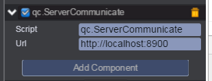

# 服务器通讯
提供与服务器的通讯功能，包含 http 与 websocket 两种通讯方式。该插件需要配合[简易服务器](server.html)使用。

## 插件面板
   
   
其中 Url 用于填写服务器的地址

将该插件挂载到任一个 node 节点上，即可通过该节点进行服务器通讯。

## HTTP 通信方式
* 使用 post 方式发送 json 数据给服务器
* post 的具体 url 地址为面板上的 Url + "/cmd"
* contentType 为 application/json;charset=UTF-8		

数据包如下所示：
````
POST http://localhost:8900/cmd HTTP/1.1
Host: localhost:8900
Proxy-Connection: keep-alive
Content-Length: 14
Cache-Control: no-cache
Origin: chrome-extension://gigaangkijllnhikjjhfmpjkddjphlie
User-Agent: Mozilla/5.0 (Windows NT 6.1; WOW64) AppleWebKit/537.36 (KHTML, like Gecko) Chrome/47.0.2526.8 Safari/537.36
Content-Type: application/json
Accept: */*
Accept-Encoding: gzip, deflate
Accept-Language: zh-CN,zh;q=0.8

{"cmd":"TEST"}
````

## websocket 通信方式
使用 socket.io 库实现 websocket，使用方式见 http://socket.io/
 
## HTTP API
* sendMessage(node, cmd, jsonData, resCallback)		
发送自定义 http 消息给服务器。

| 参数名 | 类型 | 说明 |  
| ------------- | ------------- | -------------|  
| node | qc.Node | 挂载该插件的节点 |  
| cmd | string | 消息名 |  
| jsonData | json | 消息参数数据 |  
| resCallback | function | 消息返回的回调函数，回调函数原型为：resCallback(json)，参数为 json 格式的返回数据 |  

* login(node, username, password, authInfo, resCallback)		
发送 http 登录消息给服务器，内部通过 sendMessage(node, 'LOGIN' ....) 方法发送消息。

| 参数名 | 类型 | 说明 |  
| ------------- | ------------- | -------------|  
| node | qc.Node | 挂载该插件的节点 |  
| username | string | 用户名 |  
| password | string | 明文密码，传输时会进行加密传输 |  
| authInfo | json | 登录的相关参数信息，json格式 |  
| resCallback | function | 消息返回的回调函数，回调函数原型为：resCallback(json)，参数为 json 格式的返回数据 |  

* logout(node, username, password, authInfo, saveData, resCallback)		
发送 http 登出消息给服务器，内部通过 sendMessage(node, 'LOGOUT' ....) 方法发送消息。

| 参数名 | 类型 | 说明 |  
| ------------- | ------------- | -------------|  
| node | qc.Node | 挂载该插件的节点 |  
| username | string | 用户名 |  
| password | string | 明文密码，传输时会进行加密传输 |  
| authInfo | json | 登录的相关参数信息，json格式 |  
| saveData | json | 需要保存的用户数据，json格式 | 
| resCallback | function | 消息返回的回调函数，回调函数原型为：resCallback(json)，参数为 json 格式的返回数据 |  

## SOCKET API  
* registerSocketCmd(node, cmd, func)		
注册接收指定 socket 消息的处理函数  

| 参数名 | 类型 | 说明 |  
| ------------- | ------------- | -------------|  
| node | qc.Node | 挂载该插件的节点 |  
| cmd | string | 消息名 |  
| func | function | 消息处理函数，原型为：function(node, ...) |  

* socketConnect(node, [opts])		
连接 socket 服务器  

| 参数名 | 类型 | 说明 |  
| ------------- | ------------- | -------------|  
| node | qc.Node | 挂载该插件的节点 |  
| opts | mapping | 可选的 socket.io 的选项，不传则使用默认选项 |    

* sendSocketMessage(node, cmd, ...)		 
发送定义的 socket 消息给服务器。  

| 参数名 | 类型 | 说明 |  
| ------------- | ------------- | -------------|  
| node | qc.Node | 挂载该插件的节点 |  
| cmd | string | 消息名 |  
| ... | array | 可选的参数列表 |  
返回值为 true 表示发送成功，否则发送失败  

## SOCKET 事件  
* onConnect	 
新连接创建的事件。  
原型为：function(node)  

* onDisconnect	 
连接断开的事件。  
原型为：function(node)  
 
* onError	
连接发生错误的事件。  
原型为：function(node, err)  
 
## http 范例
````javascript
	// send custom message
	qc.ServerCommunicate.sendMessage(this.gameObject, "TEST", {"data":"test"}, callback);
	
	// login
	qc.ServerCommunicate.login(this.gameObject, "testuser", "testpassword", {}, callback);
	
	// logout
	qc.ServerCommunicate.logout(this.gameObject, "testuser", "testpassword", {}, {"data":"savedata"}, callback);
````

## websocket 范例
````javascript
	// register command handler
	qc.ServerCommunicate.registerSocketCmd(this.gameObject, 'MSG_TEST_SOCKET', function(socketNode, para1, para2, para3){
        console.log(socketNode, para1, para2, para3);
    })

    // connect socket server
    qc.ServerCommunicate.socketConnect(this.gameObject);
	
	// After socket connected, we can send command to server like this
    qc.ServerCommunicate.sendSocketMessage(this.gameObject, 'TEST_SOCKET', 'para1', 2, { value : 'test'} );  
````

## Demo
[ServerCommunicate Demo](http://engine.zuoyouxi.com/demo/Net/serverCommunicate/index.html)

运行该 Demo 需要启动[简易服务器](server.html)。