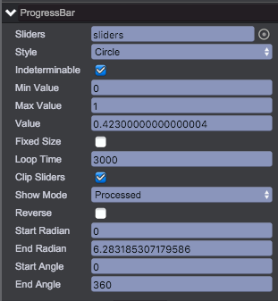

# 进度条
* 进度条qc.ProgressBar分为两种：确定进度和不确定进度
* 同时从外观上，我们提供了水平进度条、垂直进度条、角度进度条（圆）    


## 进度条构成
从主菜单(游戏对象/进度条)或工具条上创建进度条对象，得到如下的进度条对象结构：  
  
* ProgressBar - qc.ProgressBar对象，继承于[UIImage](UIImage.html)类型，作为背景图片
* progressArea - qc.Node对象，作为滚动条的显示区域，默认其完全填充满父节点ProgressBar的矩形区域
* sliders - qc.UIImage对象，作为前景图片滑块对象，设置到ProgressBar.sliders属性上

通过如下代码可实现和编辑器上创建的进度条同样的效果（当然，你应该在编辑器中直接创建，不用自己写代码实现）：
````javascript
// 创建滚动条对象
var progressBar = new qc.ProgressBar(game, parent);

progressBar.width = 160;
progressBar.height = 20;

// 创建滚动区域对象
var progressArea = game.add.node(progressBar);
progressArea.name = 'progressArea';
progressArea.setAnchor(new qc.Point(0, 0), new qc.Point(1, 1));
progressArea.setStretch(0, 0, 0, 0);
progressArea.pivotX = progressArea.pivotY = 0.5;

// 创建滑块对象
var sliders = game.add.image(progressArea);
sliders.name = 'sliders';
sliders.setAnchor(new qc.Point(0, 0), new qc.Point(1, 1));
sliders.setStretch(0, 0, 0, 0);
sliders.pivotX = sliders.pivotY = 0.5;
// 设置滚动条的滑块对象属性
progressBar.sliders = sliders;

// 设置滚动条背景图片
progressBar.texture = game.assets.find('__builtin_resource__');
progressBar.frame = 'button.png';
progressBar.imageType = qc.UIImage.IMAGE_TYPE_SLICED;
progressBar.value = 0.5;

// 设置滑块对象图片
sliders.texture = game.assets.find('__builtin_resource__');
sliders.frame = 'button.png';
sliders.imageType = qc.UIImage.IMAGE_TYPE_SLICED;

// 滑块一般设置成和progressBar一样的图片，通过设置colorTint达到灰化效果
sliders.colorTint = new qc.Color('#E0E0E0');
````

## Inspector面板说明  

* __Sliders__: UIImage类型滑块对象，node.sliders = sliders;
* __Style__: 目前支持三种进度条风格，node.style = ProgressBar.STYLE_HORIZONTAL;
	* 水平进度条 - ProgressBar.STYLE_HORIZONTAL
	* 竖直进度条 - ProgressBar.STYLE_VERTICAL
	* 圆形进度条 - ProgressBar.STYLE_CIRCLE
* __Indeterminable__: 使用不确定类型，进度条将循环播放，node.indeterminable	= true;此时，value值设置无效
* __Min Value__: 进度最小值，node.minValue = 0.0;
* __Max Value__: 进度最大值，node.maxValue = 1.0;
* __Value__: 当前进度值，node.value = 0.3;
* __Fixed Size__: 滑块所占父亲节点矩形区域百分比，1.0为整个区域，小于0.0表示不固定大小，node.fixedSize = 0.3;
* __Loop Time__: 循环时间，仅当indeterminable为true时有效，单位毫秒，node.loopTime = 3000;
* __Clip Sliders__: 是否对进度条滑块进行裁切，一般为圆形进度条时勾选，node.clipSliders = true;
* __Show Mode__: 显示方式，滑块用来表示已处理的部分，还是表示未处理的部分，node.showMode = ProgressBar.SHOW_PROCESSED;
	* ProgressBar.SHOW_PROCESSED
	* ProgressBar.SHOW_REMAINED
* __Reverse__: 是否反方向走进度条，node.reverse = false;
* __Start Radian__: 圆形进度条时起效，表示起始弧度，node.startRadian = Math.PI;
* __End Radian__: 圆形进度条时起效，表示结束弧度，node.endRadian = Math.PI;
* __Start Angle__: 圆形进度条时起效，表示起始角度，node.startAngle = 90;
* __End Angle__：圆形进度条时起效，表示结束角度，node.endAngle = 90;

## 案例：
  
  

## API
[ProgressBar API](http://docs.zuoyouxi.com/api/gameobject/CProgressBar.html)

## Demo
[ProgressBar Demo](http://engine.zuoyouxi.com/demo/ProgressBar/progressBar_mixed/index.html)
