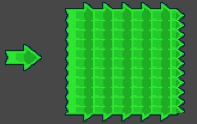

# qc.UIImage
inherit [qc.Node](CNode.md)

## Description
Displays a Texture2D.

Note that: the difference between UIImage and CSprite is, CSprite can be used for animation(such as frame animation, DragonBoned animation), UIImage is used for image display.

## Create a `UIImage`
````
    var image = new qc.game.add.image(parent);
````

## Variables
| Variable Name        |  Type     |   Description           |
| ------------- |-------------| -------------|
| texture | qc.Atlas | The texture altas used for UIImage. |
| frame | string | The frame's name in the texture atlas. |
| nativeSize | qc.Rectangle | Read only. The frame's size. |
| [imageType](image_imageType.md) | enum | How the Image is draw: UIImage.IMAGE_TYPE_SIMPLE, UIImage.IMAGE_TYPE_SLICED, UIImage.IMAGE_TYPE_TILED. See: [UIImage.imageType](image_imageType.md) |

## Methods
| Method | Description |
| ------------- |-------------|
| [resetNativeSize](image_resetNativeSize.md) | Set the UIImage's size to the frame's size. |

## Note
Atlas is suggested to use our editor tool to package, in order to fix picture gap problem.

## Example
````
game.assets.load('ui', 'assets/sprites/ui.bin', function(data) {
    var image1 = game.add.image();
    image1.texture = game.assets.find('ui');
    image1.frame = 'arrow.png';
    image1.x = 100;
    image1.y = 100;
    image1.resetNativeSize();

    var image2 = game.add.image();
    image2.texture = game.assets.find('ui');
    image2.frame = 'arrow.png';
    image2.x = 200;
    image2.y = 30;
    image2.width = 200;
    image2.height = 200;
    image2.imageType = qc.UIImage.IMAGE_TYPE_TILED;
});
````
Result:


## Manual
[UIImage](http://docs.qiciengine.com/manual/Sample/UIImage.html)