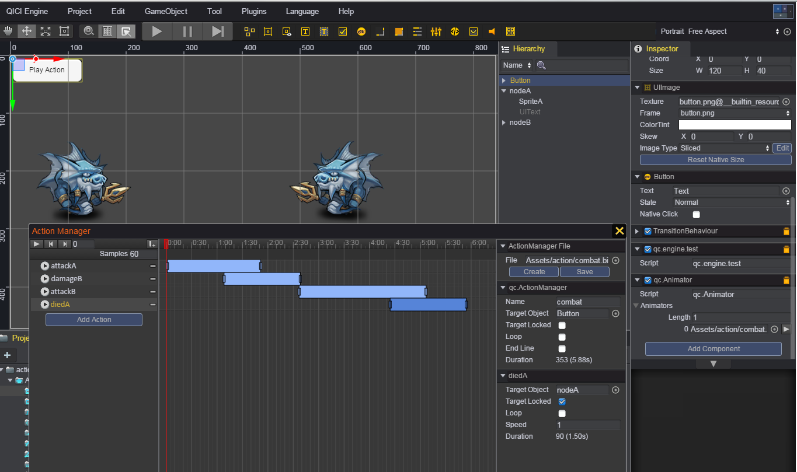

# Action Manager      
The Action Manager can be used to combine many _Action Clip_ and _Action Manager Clip_ files, and output _Action Manager Clip_ file. The _Action Manager Clip_ can be added to [_Animator_](Animator.md) component. Using [_Animator_](Animator.md) component to play  _Action Manager Clip_.  
We use _ActionState_ to represent _Action Clip_ and _Action Manager Clip_. In code, we also make qc.ActionState class to be the base class of qc.Action and qc.ActionManager class.
In addition to combining _ActionState_, the Action Manager also allows you to control the targetObject and loop attrib of _ActionState_, and also support action event.    

## Instruction for Action Manager
The Action Manager can be opened from the _Tool/Action Manager_ menu, or double click _Action Manager Clip_ file in _Assets/Action_ folder. The following picture is the capture of Action Manager:  
     
The Action Manager looks like the Action Editor, it is also divided into three parts. Please see the following:   
* The left side of the Action Manager is the _Action List View_.    
	1. At the top of the _Action List View_, there are some buttons: Play, Previous Frame, Next Frame, Add Event.  
	
	2. The buttom of the _Action List View_ is the _Action List_. See the bellow picture. If no _Action Manager Clip_ file is loaded, this list will be empty, the buttons in the _Action List View_ are disabled.
When an _Action Manager Clip_ file is loaded, the action list of the _Action Manager Clip_ will appear here.  
	At the right side of each action, there is a '-' button that is used to remove the action.   
	  
 
	You can click the _Add Action_ button to add action to this _Action Manager Clip_ file. When clicking this button, it will popup _Select Object_ window for choosing action. See the bellow picture.  
	  
	The _Select Object_ window lists all the _Action Clip_ and _Action Manager Clip_ files in the project. When choose an action, the action will be showed in the _Action List_.  
  
* The middle of the Action Manager is the _Timeline View_.    
	1. The top of the _Timeline View_ is the timescale view.  See the bellow picture:  
	  
	You can click anywhere or drag red block on the timescale view to preview or modify that frame in the _Action Manager Clip_. The numbers in the Time Line are shown as seconds and frames, so 1:05 means 1 second and 5 frames.   
	The green block on the timescale view indicates the end point. You can drag green block on the timescale to modify the duration of the _Action Manager Clip_.  
	In the following _Inspector View_, we can control the green end line to show or hide by enable or disable the _End Line_ checkbox. When the green end line is hided, the duration of the _Action Manager Clip_ is the 
	frame length that the last finished action point to. If some actions are loop, the duration is infinity.  
  
	2. The next line of the timescale view is the _Action Event window_. It's same as the _Action Event window_ of the Action Editor. Please see [Action Event window of Action Editor](ActionEditor.md#instruction-for-action-editor).    
  
	3. The buttom of the _Timeline View_ is the _Action Box_ area. See the bellow the red box of picture.  
	  
	The width of box indicates the action's duration of single loop. You can drag the edge of box to modify the play speed of the action.  
	In the region by scrolling the mouse wheel to zoom in or zoom out timeline. When the display area is exceeded, it will show vertical slider on the right side and horizontal slider on the bottom size, drag the slider bar to view the desired display area.    
	If the action is loop, the box is continuously repeated. See the bellow picture:  
	  
	You can drag the box to modify the start time of action. You can aslo press the left mouse button and drag to select multiple boxes or press _Ctrl + left mouse button_ to select multiple boxes, then reposition these boxes at the same time by dragging them.  
	By double clicking the box or right-clicking the box, choose the _Open_ menu item of popup menu, it will open the Action Editor or the Action Manager (It depends on the action is the _Action Clip_ or _Action Manager Clip_) to edit the action.   
  
* The right side of the Action Manager is the _Inspector View_. The _Inspector View_ is divided into three parts.   
	1. The top part is used to create, load, save _Action Manager Clip_ file. See the bellow picture:  
	  
	
	2. The center part is used to config properties of the _Action Manager Clip_. There are these properties: Name, Target Object, Target Locked, Loop, End Line, Duration. See the bellow picture:   
	  
	These properties's description is the following:   
	> Name: The action's name, the _Action Manager Clip_ file's name by default.  
	> Target Object: The gameObject who play the _Action Manager Clip_ file. If it's null, the _Action Manager Clip_ file cann't be played.       
	> Target Locked: Whether targetObject is locked. If it's not locked, the [_Animator_](Animator.md) component's gameObject will be set as the targetObject of the _Action Manager Clip_. Or else the targetObject is fixed.     
	> Loop: Whether the _Action Manager Clip_ is loop.     
	> End Line: Whether to show or hide the green end line.  
	> Duration: The action's duration of single loop.  
  
	3. The buttom part is used to show action information panel and event panel.   
	When select an action box, the action information panel shows. We can modify the following properties of the action: Target Object, Target Locked, Loop, Speed.  See the bellow picture:   
	  
	When select an action event, the event panel shows, see the bellow picture. The event panel is same as that in the Action Editor. See [Using Action Event](ActionEditor.md#Using-Action-Events).     
	  
  
## Demo
[Action Demo](http://engine.qiciengine.com/demo/Action/actionManager/index.html)