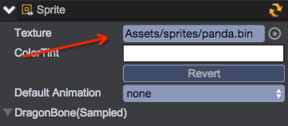
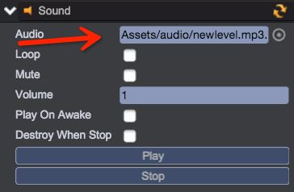

# Asset Management
There are two ways to load assets: 1. Preloaded by Reference; 2 Dynamic Loading

## Preloaded by Reference
The assets are loaded before the game logical code is executed. Normally the references are specified in [scene editing](../Scene/README.md) and [prefab editing](../Prefab/README.md)

* __Reference Texture Asset__  
Set the UIImage object's texture property or define the [qc.Serializer.TEXTURE](../Serializer/README.md) type's field in behaviour script  
  

* __Reference Animation Asset__  
Set the Sprite object's texture property or define the [qc.Serializer.TEXTURE](../Serializer/README.md) type's field in behaviour script   
  

* __Reference Sound Asset__  
Set the Sound object's audio property or define the [qc.Serializer.AUDIO](../Serializer/README.md) type's field in behaviour script  
  

* __Reference Font Asset__ 
Set the UIText object's font property or define the [qc.Serializer.FONT](../Serializer/README.md) type's field in behaviour script  
  

* __Reference Prefab Asset__   
Define the [qc.Serializer.PREFAB](../Serializer/README.md) type's field in behaviour script    

* __Reference Excel Asset__  
Define the [qc.Serializer.EXCELASSET](../Serializer/README.md) type's field in behaviour script    

* __Reference Text Asset__  
Define the [qc.Serializer.TEXTASSET](../Serializer/README.md) type's field in behaviour script     
  

## Dynamic Loading
For some assets, you don't want them to be preloaded, then you can download them at runtime programmly. See [game.assets.load](http://docs.zuoyouxi.com/api/assets/load.html)

* Load texture asset:	
````javascript
self.game.assets.load('Assets/texture/texture.bin', function(r) {
	// Find the UIImage object to set texture asset
	self.game.world.find('UIRoot/background').texture = r;
});
````

* Load audio asset
````javascript
self.game.assets.load('Assets/audio/newlevel.mp3.bin', function(r) {
	// Find the Sound object to set audio asset
	var soundCtrl = self.game.world.find('Sound');
	if (!soundCtrl.audio) {
		soundCtrl.audio = r;
	}
	soundCtrl.play();
});
````

* Load animation asset
````javascript
self.game.assets.load('Assets/sprites/panda.bin', function(r) {
	// Find the Sprite object to set animation asset
	var spriteCtrl = self.game.world.find('Sprite');
	spriteCtrl.texture = r;
	spriteCtrl.playAnimation('atk2', 1, false);
});
````

* Load webFont asset
````javascript
self.game.assets.load('Assets/font/HK.bin', function(r) {
	// Find the UIText object to set font asset
	var textCtrl = self.font.find('UIText');
	textCtrl.fontFamily = qc.UIText.WEBFONT;
	textCtrl.font = r;
});
````

* Load prefab asset
````javascript
self.game.assets.load('Assets/prefabs/prefab.bin', function(r) {
	// Clone a new game object from prefab asset, and add to the game
	self.game.add.clone(r, self.gameObject.find('list'));
});
````

* Load excel asset
````javascript
self.game.assets.load('Assets/excel/mother.bin', function(r) {
	// Print all the sheets name from the excel asset
	console.log(r.sheetsName.join(','));
});
````

* Load text asset
````javascript
self.game.assets.load('Assets/excel/mario_map.bin', function(r) {
	// Print the json content from the text asset
	console.log(r.text);
});
````

## Release Asset
We recommand to use the way "Preloaded by Reference", if you need to load assets dynamiclly, we recommand you to use URL as key, to make the keys easy to maintain:	
````javascript
// Load with one param as key and URL
self.game.assets.load('Assets/sprites/panda.bin');
````

After assets are loaded, they are saved in memory, there are two ways to unload the loaded assets. 
1. Call game.assets.unload, specify the asset key, url or object to unload.
````javascript
self.game.assets.unload('Assets/sprites/panda.bin');
````
2. When switching scene, set the second param as true to clear all the loaded assets
````javascript
self.game.state.load('nextState', true);
````  

## API
[Assets API](http://docs.qiciengine.com/api/assets/Assets.html)

## Demo
[Assets Demo](http://engine.qiciengine.com/demo/index.html#anchor_Assets)      