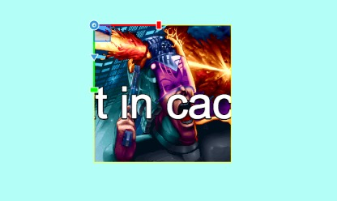
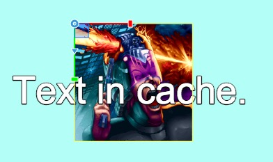

# CacheAsBitmap

Some nodes are composed of many children parts, if some parts are seldom changed, then you can add qc.CacheAsBitmap component on the node to cache it and children as a bitmap image. Caching as bitmap can reduce the draw calls to improve the rendering performance.

````javascript
var cacheAsBitmap = node.addScript('qc.CacheAsBitmap');
````

## Cache Type
There are two cache types:  

1. __Cache For Self__  
Use this node as the origin, cache itself and all of the children. You don't need to update the cache when the node's rotation or scale are changed. If the node is rotated or scale, the text node will be blur, because the image content isn't cached directly from the screen result. 
````javascript
cacheAsBitmap.cacheType = qc.CacheAsBitmap.CACHE_FOR_SELF;
````

2. __Cache For Screen__  
Use the screen as coordinate system, cache itself and all of the children. You need to update the cache(cacheAsBitmap.dirty = true) when the node's rotation or scale are changed. In this cache type the text has not the blur issue like 'Cache For Self' type, but it's not suitable for the case that the node need to be rotated or scaled.
````javascript
cacheAsBitmap.cacheType = qc.CacheAsBitmap.CACHE_FOR_SCREEN;
````

See the difference of the CacheAsBitmap results between two cache types when the node's scale is (3, 3):  

|Cache For Self|Cache For Screen|
|:-----:|:-----:|
|||

##Bounds Type
In some case you don't need to display all parts of the children, for reducing memory consumption, there are two bounds types for choosing: 	
1. __Only Self__  
If the children' bounds got out of the node's bounds, then they will be clip.
````javascript
cacheAsBitmap.boundsType = qc.CacheAsBitmap.BOUNDS_SELF;
````

2. __All Children__  
The node's bounds and all the children's bounds will be included in the cache image.
````javascript
cacheAsBitmap.boundsType = qc.CacheAsBitmap.BOUNDS_ALL;
````

*__Notice:__* The UIText's bounds is used to consider the bounds, not the displaying text's area. 

|Only Self|All Children|
|:-----:|:-----:|
|||

*__Notice:__* If the cache image area is bigger then the screen, for reducing memory consumption, you can check the 'Bounds In Screen' option to cache the screen area only.
````javascript
cacheAsBitmap.boundsInScreen = true;
````


