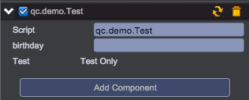

# Inspector Extending

1. Create a scrpit in Assets/Editor/Test.js
````javascript
// Extend Inspector 
// The first parameter specify the class name for extending
// The second parameter defines the drawing function
G.extend.inspector('qc.demo.Test', function() {
    var self = this,
        target = self.target;

    // call default drawing method first
    self.defaultDraw();

    // draw custom content
    var gui = qc.editor.gui;
    gui.columnWidths = ["70+0.1", "60+0.5"];
    gui.line([
        gui.text('Test'),
        gui.text('Test Only')
    ]);
});
````

2. Create a scrpit in Assets/Editor/Test.js
````javascript
qc.defineBehaviour('qc.demo.Test', qc.Behaviour, function() {
	this.birthday = '19811001';
}, {
    // Define a string field to be serializable and editable on inspector
    birthday: qc.Serializer.STRING
});
````

3. Reload web page and add this script component to a Node
4. Select the Node and see the Inspector panel result:        
   

## GUI Using

* [GUI Layouts](Layout.md)
* [GUI Components](Component.md)

