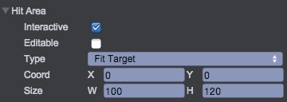

# Input and Interaction

## Capture and Handle Input Event of Node
Let's make a demo to understand how to capture and handle mouse(or touch) event.

### Solution I: Method Overriding
1. Create an UIImage node, set image and bounds.
2. Make "Interactive" checked to enable capturing input events.  
  
3. Create a script InputTest.js, attach this script to the UIImage node

````javascript
var InputTest = qc.defineBehaviour('qc.demo.InputTest', qc.Behaviour,
    function() {
    },
    {
		// Fields to be serialized
    }
);

// handle mouse(or touch) down event
InputTest.prototype.onDown = function(e) {
    console.log('onDown', e);

    // If return true, this event will stop propagation to other scripts
    // return true;
};

// handle mouse(or touch) up event
InputTest.prototype.onUp = function(e) {
    console.log('onUp', e);

    // If return true, this event will stop propagation to other scripts
    // return true;
};

// handle mouse(or touch) click event
InputTest.prototype.onClick = function(e) {
    console.log('onClick', e);

    // If return true, this event will stop propagation to other scripts
    // return true;
};
````

Run it, click on the UIImage node, and check console log:
  * 3 events are triggered when the UIImage node is clicked: onDown, onClick, onUp
  * so long as these methods are overrided on script, system will call them automatically when user click on the node

### Solution II：Adding Event Listeners
1. Modify InputTest.js script to：  

````javascript
var InputTest = qc.defineBehaviour('qc.demo.InputTest', qc.Behaviour, function() {
},
{
    // Fields to be serialized
});
// Add event listeners on awake
InputTest.prototype.awake = function() {
    var self = this,
        o = this.gameObject;

    // Add event listeners
    this.addListener(o.onDown, self._onDown, self);
    this.addListener(o.onClick, self._onClick, self);
    this.addListener(o.onUp, self._onUp, self);
};

// handle mouse(or touch) down event
InputTest.prototype._onDown = function(node, pointerEvent) {
    console.log('onDown', node, pointerEvent);
};

// handle mouse(or touch) up event
InputTest.prototype._onUp = function(node, pointerEvent) {
    console.log('onUp', node, pointerEvent);
};

// handle mouse(or touch) click event
InputTest.prototype._onClick = function(node, pointerEvent) {
    console.log('onClick', node, pointerEvent);
};
````

Run and test it, you can see the same result as before.

## Drag and Drop
The sample below demostrates how to drag a node to a specifical position  

1. Create two UIImage nodes, set image and bounds
2. Make "Interactive" checked on both nodes to enable capturing input events
3. Attach the DragTest.js script to the node to be dragged  

````javascript
var DragTest = qc.defineBehaviour('qc.demo.DragTest', qc.Behaviour, function() {
},
{
    // Fields to be serialized
});

// Called at the beginning of dragging
DragTest.prototype.onDragStart = function(e) {
    console.log('Start Drag', e);

    // record current position and mark drag start
    this.oldPos = new qc.Point(this.gameObject.x, this.gameObject.y);
    this.drag = true;
    this.drop = false;
};

// Called on dragging
DragTest.prototype.onDrag = function(e) {
    console.log('Dragging');

    if (this.drag) {
        // change node position
        var p = this.gameObject.getWorldPosition();
        p.x += e.source.deltaX;
        p.y += e.source.deltaY;
        p = this.gameObject.parent.toLocal(p);
        this.gameObject.x = p.x;
        this.gameObject.y = p.y;
    }
};

// Called on drag end
DragTest.prototype.onDragEnd = function(e) {
    console.log('End Drag', e);

    // finish dragging
    this.drag = false;

    if (!this.drop) {
        // not droppable, reset to original position
        console.log('reset position.');
        this.gameObject.x = this.oldPos.x;
        this.gameObject.y = this.oldPos.y;
    }
};
````
4. Attach the DropTest.js script to the node as a droppable container:  

````javascript 
var DropTest = qc.defineBehaviour('qc.demo.DropTest', qc.Behaviour, function() {
},
{
	// Fields to be serialized
});

// Check whether dragging node can be dropped
DropTest.prototype.isAllowDrop = function(node) {
    // 50% probability can
    var r = this.game.math.random(0, 1) === 0;
    console.log(r ? 'Can Drop.' : 'Cannot Drop.');
    return r;
};

// Dragging node is dropped
DropTest.prototype.onDragDrop = function(e) {
    console.log('Drop Drag', e);

    // put dropping node in
    var node = e.dragging;
    node.parent = this.gameObject;
    node.x = 0;
    node.y = 0;

    // mark drop flag
    node.getScript('qc.demo.DragTest').drop = true;
};
````

5. Run and drag the node to target container, it will be bounced back or put into the target container node.

Note：
* Define onDragStart, onDrag and onDragEnd methods on dragging node's script to process dragging events
* If need drop target, then define onDragDrop method on target node's script to handle drop logic
* In some case, only when some condition is satisified, then the dragging node can be dropped. Just define isAllowDrop method on target node's script to implement condition check. To make it simple in the sample code above, the droppability is 50%
* Workflow：DragTest.onDragStart -> DragTest.onDrag -> DropTest.isAllowDrop -> DropTest.onDragDrop -> DragTest.onDragEnd

## Capture and Handle Input Event Globally
For processing global mouse, touch and keyboard events, please reference [Input API](http://docs.qiciengine.com/api/input/Input.html)

## Demo
* [DragAndDrop Demo](http://engine.qiciengine.com/demo/Input/input_dragAndDrop/index.html)
* [Input Demo](http://engine.qiciengine.com/demo/index.html#anchor_Input)
