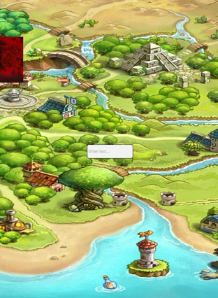
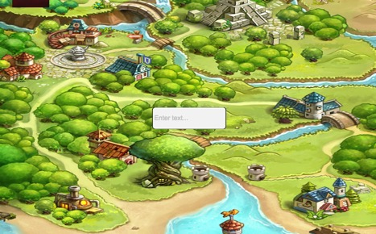
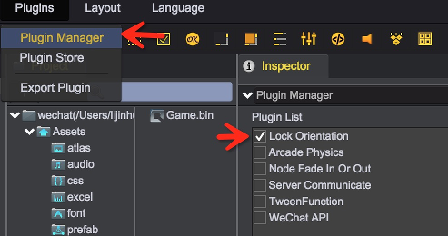

# Lock Orientation

When the device switches between portrait and landscape orientation, the 'screen size' also changes. Therefore the whole UI system will be rearranged automatically for adapting new orientation.

Original UI (portrait)  

After rotate 90 degrees (without lock orientation)  

In some cases, we hope the UI system remains the same although the orientation of device is changed, then we need to use the Lock-Orientation plugin.

## Enable Lock Orientation
Lock-Orientation plugin has been integrated in QICI editor as a built-in plugin. To enable the plugin, just open PluginManager panel through menu Plugins->PluginManager, and check the 'Lock Orientation' option.   
   

## LockOrientation Component
To use this component, we need to attach it to the node which need to keep the original orientation(usually not UIRoot node). After this, when the device switches between portrait and landscape orientation, the node will rotate accordingly, in order to keep the original layout.  

### Orientation
The game is landscape or portrait.

### Desktop
Whether it work on PC(if selected, you can simulate the device is rotated in the preview page, and preview effects after rotation)

After rotate 90 degrees (with lock orientation)   
 

## Demo
[LockOrientation Demo](http://engine.qiciengine.com/demo/Plugin/lock_orientation/index.html)