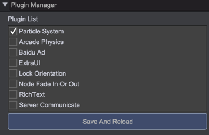
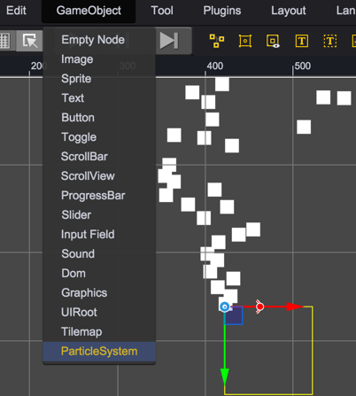

# Particle System

Particle System in QICI can be used to simulate smoke, fire, explosion and other atmospheric effects (such as rain and snow etc.). Through Particle System, we can simulate these above-mentioned effects even use a small number of pictures.

# Enable Particle System

Particle System has been integrated in QICI as a built-in plugin. To enable the plugin, just open PluginManager panel through menu Plugins->PluginManager, and check the 'Particle System' option.  
   

# Create a Particle System

You can create a new particle system by creating a Particle System GameObject (menu GameObject -> Particle System).  
   

# The Particle System Inspector
Select the particle system object in the scene, you can view the properties through the inspector panel, modify them and preview. It looks like this:   
     

| Properties | Description |
| ------------- | ------------- |
| Textures |  Array of textures that the particle will use. Texture is picked at random.  |
| Zone | The shape of the emission zone. Currently supports four types: Zone.POINT(point), Zone.LINE(line), Zone.CIRCLE(circle) and Zone.RECTANGLE(rectangle). |
| Frequency | How often per emission, in seconds.  |
| Quantity | How many particles will be generated per emission. |
| Repeat | The repeat count of emission, -1 means loop always. |
| Delay | The delay time of the first emission in seconds. |
| Lifespan | How long each particle lives once it is emitted in seconds. |
| Angle | The emission angle of particles, the value is picked at random within specified min-max range. |
| BlendMode | The blend mode of particle.  |
| SrcColorTint | The start color of particle. |
| DstColorTint | The target color of particle. |
| StartAlpha | The transparency of particles, the value is picked at random within specified min-max range. |
| StartScale | The start scale of particles, the value is picked at random within specified min-max range. |
| StartRotation | The start rotation of particles, the value is picked at random within specified min-max range. |
| StartVelocity | The start velocity of particles, the value is picked at random within specified min-max range. |
| AngularVelocity | The start angular velocity of particles, the value is picked at random within specified min-max range. |
| Gravity | The gravity of particle systems. |
| MaxParticles | The maximum number of particles, the emission will be stopped when the number of particles exceeds this value. |
| PlayOnAwake | Whether the particle system will start playing automatically. If set to false, we need call relative method manually for emitting particles.(see [ParticleSystem API](http://docs.zuoyouxi.com/api/officialplugins/particleSystem/CParticleSystem.html)) |

# Color Control Module  
    
If enable this module, we can control the color change of each particle in the lifespan through a curve. If this module is off, the particle color will vary linearly between srcColorTint and dstColorTint.

# Alpha Control Module   
   
If enable this module, we can control the transparency change of each particle in the lifespan through a curve.   
Note: If the transparency of the particle remains unchanged, this module should be turned off for better performance.

# Scale Control Module    
   
If enable this module, we can control the scale change of each particle in the lifespan through a curve.   
Note: If the scale of the particle remains unchanged, this module should be turned off for better performance.

# Velocity Control Module    
   
If enable this module, we can control the velocity change of each particle in the lifespan through a curve.   
Note: If the velocity of the particle remains unchanged, this module should be turned off for better performance.

# Angular Velocity Control Module    
   
If enable this module, we can control the angular velocity change of each particle in the lifespan through a curve.   
Note: If the angular velocity of the particle remains unchanged, this module should be turned off for better performance.

## API
[ParticleSystem API](http://docs.qiciengine.com/api/officialplugins/particleSystem/CParticleSystem.html)

## Demo
[ParticleSystem Demos](http://engine.qiciengine.com/demo/index.html#anchor_ParticleSystem)  
