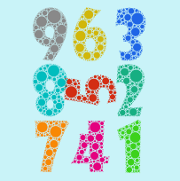
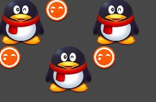
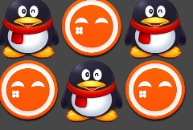
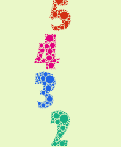
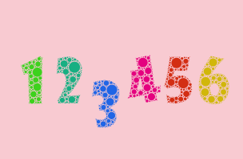

# Table Layout
The qc.TableLayout component can be added to any game object. The TableLayout component will figure out the row count, column count, and the cell size, according to the count and size of the node's visible children, then it will place the visible children to the right cell where they belong.

````javascript
var tableLayout = node.addScript('qc.TableLayout');
````

## Size Provider

Before layouting, the TableLayout component needs to determine the size for cell, it will use the cellWidth and cellHeight of the TableLayout('Cell Size' in Inspector).
````javascript
tableLayout.cellWidth = 200;
tableLayout.cellHeight = 160;
````

If the value cellWidth or cellHeight is 0, then it will use the visible children's size to figure out the size of cell. There are two ways to get the size of child node:  

* **RectTransform**  
Just the node's raw width and raw height, don't consider the rotation and scale effect. So if the rotation or scale value are changed, they will not effect the layout result.
````javascript
tableLayout.contentSizeProvider = qc.TableLayout.USE_RECTTRANSFORM
````

* **RealBounds**  
The real bounds that contians the whole node considering rotation and scale. So if the rotation or scale value are changed, they will effect the layout result.
````javascript
tableLayout.contentSizeProvider = qc.TableLayout.USE_BOUNDS
````

See the difference:	


| RectTransform | RealBounds |
|:------:|:------:|
|||

## Layout Style
After figuring out the size for child node, there are two ways to place them:

* **Wrap Element**  
Keeping the child node's original size. If the child node's size is smaller then the cell size, there will be some blank space left.
````javascript	
tableLayout.style = qc.TableLayout.STYLE_WRAP_ELEMENT
```` 


* **Resize Element**  
Resizing the child node's size to make them fit into the cell size.
````javascript	
tableLayout.style = qc.TableLayout.STYLE_RESIZE_ELEMENT
````


__Notice: In 'Resize Element' mode if the node is rotated, then the result is uncertain.__

## Constraint
The constraint determines how to layout the cells.
* **Flexible**  
In this constraint, the 'Cell Size' must be confiured, and the cells are layouted and limited inside the node's bounds.
````javascript	
tableLayout.constraint = qc.TableLayout.CONSTRAINT_FLEXIBLE;
````
* **Fix Column Count**  
The column count is fixed, and the row count is dynamic. In this case, the stride property means the column count, and the startAxis should be set as qc.TableLayout.AXIS_HORIZONTAL.
````javascript	
tableLayout.constraint = qc.TableLayout.CONSTRAINT_FIX_COLUMN_COUNT;
tableLayout.startAxis = qc.TableLayout.AXIS_HORIZONTAL;
tableLayout.stride = 3; // column count
````
* **Fix Row Count**  
The row count is fiexed, and the column count is dynamic. In this case, the stride property means the row count, and the startAxis should be set as qc.TableLayout.AXIS_VERTICAL. 
````javascript	
tableLayout.constraint = qc.TableLayout.CONSTRAINT_FIX_ROW_COUNT;
tableLayout.startAxis = qc.TableLayout.AXIS_VERTICAL;
tableLayout.stride = 3; // row count
````	

## Layout Cells  
After the constraint value is determined, the tableLayout will figure out the whole bounds for layouting all the cells, then it begin to layout the cells row by row (or column by column) according to the startCorner and startAxis.

### Start Corner  
* __Top Left__: Start layout the first cell from the top left corner
````javascript	
tableLayout.startCorner = qc.TableLayout.CORNER_TOP_LEFT;
````
* __Top Right__: Start layout the first cell from the top right corner
````javascript	
tableLayout.startCorner = qc.TableLayout.CORNER_TOP_RIGHT;
````
* __Bottom Left__: Start layout the first cell from the bottom left corner
````javascript	
tableLayout.startCorner = qc.TableLayout.CORNER_BOTTOM_LEFT;
````
* __Bottom Right__: Start layout the first cell from the bottom right corner
````javascript	
tableLayout.startCorner = qc.TableLayout.CORNER_BOTTOM_RIGHT;
````

### Start Axis
* __Horizontal__: Layout out cells row after row
````javascript	
tableLayout.startAxis = qc.TableLayout.AXIS_HORIZONTAL;
````
* __Vertical__: Layout out cells column after column
````javascript	
tableLayout.startAxis = qc.TableLayout.AXIS_VERTICAL;
````

In the sample below, we layout 5 element in a tableLayout of 3*2, see the results:	

|    | Top Left | Top Right | Bottom Left | Bottom Right |
|:--:|:--:|:--:|:--:|:--:|
| __Horizontal__ |  |  |  |  |
| __Vertical__ |  |  |  |  |

## Content Alignment
Noramlly the table content's size is different to the node's size, then the contentAlignment can be used to determine the align mode relative to the node.

* ** __Top__: ** The top side of the table is align to the top of the node
* ** __Middle__: ** The vertical middle of the table is align to the vertical middle of the node  
* ** __Bottom__: ** The bottom side of the table is align to the bottom of the node
* ** __Left__: ** The left side of the table is align to the left of the node
* ** __Center__: ** The horizontal center of the table is align to the horizontal center of the node  
* ** __Right__: ** The right side of the table is align to the right of the node

````javascript	
tableLayout.contentAlignment = qc.TableLayout.ALIGN_TOP_LEFT;
tableLayout.contentAlignment = qc.TableLayout.ALIGN_TOP_CENTER;
tableLayout.contentAlignment = qc.TableLayout.ALIGN_TOP_RIGHT;
tableLayout.contentAlignment = qc.TableLayout.ALIGN_MIDDLE_LEFT;
tableLayout.contentAlignment = qc.TableLayout.ALIGN_MIDDLE_CENTER;
tableLayout.contentAlignment = qc.TableLayout.ALIGN_MIDDLE_RIGHT;
tableLayout.contentAlignment = qc.TableLayout.ALIGN_BOTTOM_LEFT;
tableLayout.contentAlignment = qc.TableLayout.ALIGN_BOTTOM_CENTER;
tableLayout.contentAlignment = qc.TableLayout.ALIGN_BOTTOM_RIGHT;
````

## Padding
If the table content need to have some space left after aligning, you can use 'Padding' to adjust.
* ** Left: ** The offset relative to the left side of the node
````javascript	
tableLayout.paddingLeft = 5;
````
* ** Right: ** The offset relative to the right side of the node
````javascript	
tableLayout.paddingRight = 5;
````
* ** Top: ** The offset relative to the top side of the node
````javascript	
tableLayout.paddingTop = 5;
````
* ** Bottom: ** The offset relative to the bottom side of the node
````javascript	
tableLayout.paddingBottom = 5;
````

## Cell Alignment
If the tableLayout's style is qc.TableLayout.STYLE_WRAP_ELEMENT, The child node's size may be smaller then the cell's size, then the cellAlignment can be used to determine the align mode relative to the cell.

* ** __Top__: ** The top side of the child node is align to the top of the cell
* ** __Middle__: **  The vertical middle of the child node is align to the vertical middle of the cell  
* ** __Bottom__: ** The bottom side of the child node is align to the bottom of the cell
* ** __Left__: ** The left side of the child node is align to the left of the cell
* ** __Center__: ** The horizontal center of the child node is align to the horizontal center of the cell  
* ** __Right__: ** The right side of the child node is align to the right of the cell

````javascript	
tableLayout.cellAlignment = qc.TableLayout.ALIGN_TOP_LEFT;
tableLayout.cellAlignment = qc.TableLayout.ALIGN_TOP_CENTER;
tableLayout.cellAlignment = qc.TableLayout.ALIGN_TOP_RIGHT;
tableLayout.cellAlignment = qc.TableLayout.ALIGN_MIDDLE_LEFT;
tableLayout.cellAlignment = qc.TableLayout.ALIGN_MIDDLE_CENTER;
tableLayout.cellAlignment = qc.TableLayout.ALIGN_MIDDLE_RIGHT;
tableLayout.cellAlignment = qc.TableLayout.ALIGN_BOTTOM_LEFT;
tableLayout.cellAlignment = qc.TableLayout.ALIGN_BOTTOM_CENTER;
tableLayout.cellAlignment = qc.TableLayout.ALIGN_BOTTOM_RIGHT;
````

## Spacing Size
By default there is no space between cells, you can use 'Spacing Size' to adjust the space between cells.
* ** x: ** The horizontal space between cells, there is no space before the first cell.  
````javascript	
tableLayout.spacingX = 5;
````
* ** y: ** The vertical space between cells, there is no space before the first cell.  
````javascript	
tableLayout.spacingY = 5;
````

## Ignore X/Y
When the table has only one row or one column, then you can use ignoreX or ignoreX to reach some effect.

* ** Ignore X Pos: ** If the 'Ignore X' option is checked, then the layout will change the 'y' value only, you can customize the 'x' value.   
````javascript	
tableLayout.ignoreX = true;
````
  

* ** Ignore Y Pos: ** If the 'Ignore Y' option is checked, then the layout will change the 'x' value only, you can customize the 'y' value.   
````javascript	
tableLayout.ignoreY = true;
````
  

[TableLayout API](http://docs.qiciengine.com/api/components/TableLayout.html)

## Demo
[Demo_1](http://engine.qiciengine.com/demo/Layout/tablelayout/index.html)
[Demo_2](http://engine.qiciengine.com/demo/Layout/android/index.html)
