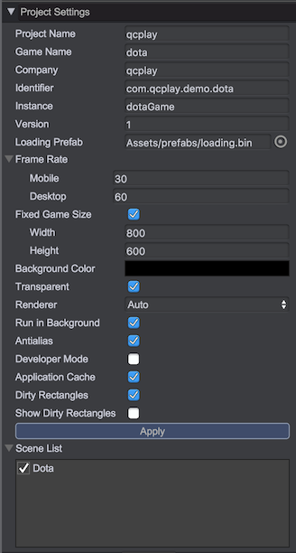

# Project Settings

## Open Project Settings
Select __'Project/Settings...'__ from main menu		
  

## Property Instruction
* __Project Name__ - The name of current project
* __Game Name__ - The name of this game, will display as title on webpage
* __Company__ - The name of company or developer
* __Identifier__ - The unique identifier, like: demo.qiciengine.com, game.storage use it for saving
* __Instance__ - The variable name for game instance, for example: qc_name, then you can access the game instance by window.qc_game in webpage
* __Version__ - The version of this game, like: 2.0.1, see [Publishing](../Publish/index.html)
* __Loading Prefab__ - The Prefab for scene loading and switching, see [Loading Screen](../LoadingPrefab/index.html)	
* __Background Color__ - The background color of this game
* __Transparent__ - Determines transparent or not in game background
* __Renderer__ - Determine the render mode: WebGL, Canvas or Auto
* __Run in Background__ - Determines whether or not to continue run the game when focus lost 
* __Antialias__ - Determines whether or not to enable antialias
* __Developer Mode__ - If in developer mode, debug information will be printed to the browser's console
* __Application Cache__ - Determines whether or not to enable [Application Cache](https://developer.mozilla.org/en-US/docs/Web/HTML/Using_the_application_cache), If enable, it will generate a manifest file named qici.appcache in publish.   

*Remember to click 'Apply' button to make all the changes to be saved.*

<video controls="controls" src="../video/change_settings.mp4"></video>  

## Scene List
* All scenes in Assets/state folder will be listed
* Check all the scenes that you want to publish
* The first checked scene will act as the entry scene of this game, that will be used to initialize game and load assets, you can change the order of scenes by-drag-and drop directly.	
 
