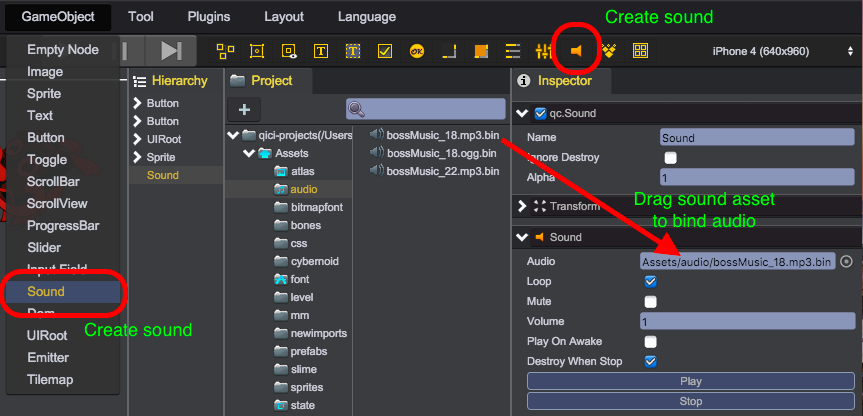

# Sound

## Supported Formats
Currently QICI Engine(qc.Sound) supports both __mp3__ and __ogg__ formats.

## Import Sound Assets
Just drag the sound files to drop into Project panel(We recommend to place in Assets/audio folder)

## Using Sound Programmly

````javascript
// Download sound asset and play
game.assets.load('audio_test', 'Assets/audio/CM_ATK.mp3.bin', function(audio) {
	// Create sound object
	var sound = game.add.sound();

	// Set loaded sound asset(qc.SoundAsset) to audio property
	sound.audio = audio;

	// Destroy the sound object after stop playing
	sound.destroyWhenStop = true;

	// Start to play
	sound.play();
});
````

## Using Sound in Editor
1. Create a sound object from main menu(GameObject/sound) or sound button on toolbar
2. Drag sound asset to bind to the sound object
3. Set the properties properly in Inspector panel:
	* __Loop__ - Whether or not the sound will loop, node.loop = true;
	* __Mute__ - whether the sound is muted or not, node.mute = true;
	* __Volume__ - The volume at which the sound will be played, node.volume = 1.0;
	* __Play On Awake__ - Whether to play sound when awake or not,bnode.playOnAwake = true;
	* __Destroy When Stop__ - Whether to destroy the sound when stop, node.destroyWhenStop = true;
	* __Play__ - Start to play, node.play();
	* __Stop__ - Stop playing, node.stop();



## Audio Browser Compatibility
When playing sound, QICI Engine will try to use [Web Audio](http://www.w3.org/TR/webaudio), if the browser supports it, or QICI Engine will use [Audio Tag](http://www.w3.org/wiki/HTML/Elements/audio) to play sound.

Most browsers support mp3 format, for those not support QICI will use ogg format, __so you should put both mp3 and ogg format files in the same folder and have the same name__, such as background.mp3 and background.ogg. Thus QICI Engine will download mp3 or ogg smartly and automatically.

*You can freely choose .mp3.bin or .ogg.bin to bind to audio, QICI Engine will download the correct one basing on the running browser.*

## API
[Sound API](http://docs.qiciengine.com/api/gameobject/CSound.html)

## Demo
[Sound Demo](http://engine.qiciengine.com/demo/Audio/audioSupportInfo/index.html)
