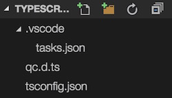

# TypeScript Support

## Init the TypeScript Project
Select the menu: Project/TypeScript/Init，and editor will create 'TypeScripts' folder in the root of project. TypeScript filea are placed here. The initial directory tructure shows as:  
  

* qc.d.ts: delear qc typescript api.
* tsconfig.json and .vscode: config for "Visual Studio Code".

 We commend [Visual Studio Code](https://www.visualstudio.com/products/code-vs) to write typescript codes.

## Create a ts file
Open the folder 'TypeScripts' using 'Visual Studio Code' and create file 'Test.ts':   
````javascript
namespace qc.demo {
    export class Test extends Behaviour {
        year: number;
        private serializableFields: Object = {
            year: qc.Serializer.NUMBER
        }
        
        constructor(gameObject: Node) {
            super(gameObject);
            
            // Init the behaviour
            this.year = 2016;
        }
    }
    qc.registerBehaviour('qc.demo.Test', Test);
}

````

This is a standard template for defining a Behaviour class(same to api: qc.defineBehaviour). We define a class 'Test' here, and it's namespace is 'qc.demo'. We define a serializable property 'year' in the class. Call 'qc.registerBehaviour' to register this behaviour last.

## Build
There are 2 ways to built the project:  
1. Build in the tool: 'Visual Studio Code'
2. Select the menu: Project/TypeScript/Build in the qici editor.

File 'ts.js' are generated in the 'Scripts' folder after building. Then everying is the same to the javascript.

## Demo
* [TypeScript Demo](http://engine.zuoyouxi.com/demo/index.html#anchor_TypeScript)
