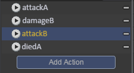
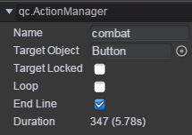
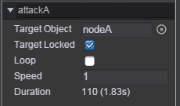

# 动作管理器   
使用动作管理器可对 _动作剪辑_ 和 _动作管理器剪辑_ 文件进行任意串行、并行组合，可生成 _动作管理器剪辑_ 文件，_动作管理器剪辑_ 文件可以挂载到 [_Animator_](Animator.md) 组件中，实现相应的动作播放。
我们将 _动作剪辑_ 和 _动作管理器剪辑_ 统称为 _ActionState_，在代码层次中，也是用 qc.ActionState 类作为 qc.Action 和 qc.ActionManager 的基类。  
动作编辑器除了任意组合 _ActionState_ 之外，还可单独控制 _ActionState_ 的 targetObject 和 loop 等属性，并支持帧事件。

## 动作管理器介绍  
可通过菜单 _Tool/Action Manager_，或双击 Assets/Action 目录下的 _动作管理器剪辑_ 文件打开动作管理器。以下是动作管理器的界面截图：  
     
动作管理器与动作编辑器类似，分为左中右三个部分，以下依次进行介绍：  
* 动作管理器左部是动作列表视图。  
	1. 顶部有一些常用功能按钮，包括播放、下一帧、上一帧、新增事件；可设置每秒的帧数，以及显示和设置红色时间线所在的当前帧数。  
	
	2. 下部是动作列表，见下图。当没有加载 _动作管理器剪辑_ 文件时，动作列表为空，动作列表视图的按钮都不允许点击。当加载 _动作管理器剪辑_ 文件时，该 _动作管理器剪辑_ 文件的动作列表会被列出。
每个动作名的右侧有个减号，可以用来删除动作。  
  
   
	点击 _Add Action_ 按钮，会弹出动作选择框，见下图。该框中列出工程下所有的 _动作剪辑_ 和 _动作管理器剪辑_ 文件，选择其中一个动作，会在动作列表中显示出来。    
      
  
* 动作管理器中部是时间线视图。    
	1. 顶部显示时间刻度，点击时间刻度可以设置当前帧，也可直接拖动时间刻度上的红方块来设置当前帧。绿方块所对应的时间线为动作结束时间线，可拖动绿方块来调整该 _动作管理器剪辑_ 的单次播放时长。  
	  
	在后续介绍的属性面板视图中，可以控制结束时间线的显示和隐藏，当隐藏结束时间线时，该 _动作管理器剪辑_ 的播放时长为最后一个播放完毕的动作所对应的时长，如果某个动作是循环播放的，则该 _动作管理器剪辑_ 的播放时长就为无限大，即一直播放。
	
	2. 时间刻度的下一行是动作事件区域，动作事件帧显示在该区域，与动作编辑器相同，可参考[动作编辑器的动作事件区域](ActionEditor.md#动作管理器介绍)。
	
	3. 下部是动作方块显示区域，见下图的红色区域。  
	  
	动作方块的宽度代表该动作单次播放的时长，可通过拖拽动作方块的左右边缘调整该动作的播放速度。  
	该区域可通过滚动鼠标滚轮进行放大或缩小时间轴的显示比例。当显示区域超出时，会显示出右侧的垂直滑条和底部的水平滑条，可拖动滑条查看期望的显示区域。  
	若动作为循环播放，则会显示连续的动作方块，见下图的红色区域。  
	  
	鼠标左键选中动作方块，可以拖拽移动动作方块，来控制该动作的播放起始时间。通过鼠标左键拖拽或Ctrl+鼠标左键可选中多个动作方块，同时移动多个选中的方块。  
	双击动作方块，或右击动作方块，选中右键菜单中的_打开_选项，可打开动作编辑器或动作管理器（取决于该动作是 _动作剪辑_ 还是 _动作管理器剪辑_）对该动作进行编辑。  
	
* 动作管理器右部是属性面板视图，该视图分为上中下三个部分。  
  
	1. 上部区域可用于创建、加载、保存 _动作剪辑_ 文件，见下图：   
	  
  
	2. 中部区域用于设置和查看该动作管理器的属性，有 Name、Target Object、Target Locked、Loop、End Line、Duration 几个属性，见下图：    
	  
	各属性说明如下：
	> Name 属性默认为 _动作管理器剪辑_ 文件名。  
	> Target Object 属性为播放该 _动作管理器剪辑_ 的目标对象，没有设置该属性，无法播放该 _动作管理器剪辑_     
	> Target Locked 属性表示是否锁定 Target Object 属性，若没有勾选，[_Animator_](Animator.md) 组件的 gameObject 对象会设置为该动作的 Target Object 属性值；若勾选了，则该 _动作管理器剪辑_ 的 Target Object 属性值固定，不会被修改。  
	> Loop 属性表示是否循环播放。  
	> End Line 属性表示是否显示结束时间线，参考上文中的时间线视图的绿色结束时间线的说明。  
	> Duration 属性表示该 _动作管理器剪辑_ 单次播放的时长。    
  
	3. 下部区域用于显示动作信息和动作事件的区域。  
	当选中动作方块，则显示动作信息面板，见下图，可自行修改该动作的 Target Object、Target Locked、Loop、Speed 四个属性。    
	  
	当选中动作事件节点，则显示动作事件面板，见下图，动作事件的编辑与动作编辑器相同，可参考 [动作编辑器的动作事件编辑](ActionEditor.md#使用动作事件)    
      

## Demo
[Action Demo](http://engine.zuoyouxi.com/demo/Action/actionManager/index.html)
