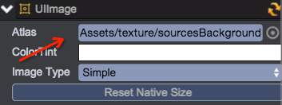
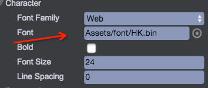

# 资源管理
游戏资源有两种加载方式：1、引用预先加载；2、手工动态加载

## 引用预先加载
引用预先加载指游戏资源在[场景编辑](../Scene/README.md)和[预制编辑](../Prefab/README.md)中进行引用关联，当游戏运行或场景切换时，这引用资源会自动预先载入。

* __引用图片资源__  
直接使用UIImage组件，或者在脚本中定义meta类型为[qc.Serializer.TEXTURE](../Serializer/README.md)的字段。  
  
* __引用动画资源__  
直接使用Sprite组件，或者在脚本中定义meta类型为[qc.Serializer.TEXTURE](../Serializer/README.md)的字段。  
  
* __引用声音资源__  
直接使用Sound组件，或者在脚本中定义meta类型为[qc.Serializer.AUDIO](../Serializer/README.md)的字段。  
  
* __引用字体资源__  
直接在UIText组件中设置，或者在脚本中定义meta类型为[qc.Serializer.FONT](../Serializer/README.md)的字段。  
  
* __引用预制资源__   
在脚本中定义meta类型为:[qc.Serializer.PREFAB](../Serializer/README.md)的字段。  
* __引用Excel资源__  
在脚本中定义meta类型为:[qc.Serializer.EXCELASSET](../Serializer/README.md)的字段。  
* __引用文本资源__   
在脚本中定义meta类型为:[qc.Serializer.TEXTASSET](../Serializer/README.md)的字段。  
  

## 手工动态加载
对于一些可变资源，或者不希望进入游戏就加载的资源，可以通过代码，使用[game.assets.load](http://docs.zuoyouxi.com/api/assets/load.html)进行异步加载。
例如：

* 载入一个图片资源：
````javascript
self.game.assets.load('Assets/texture/texture.bin', function(r) {
	self.game.world.find('UIRoot/background').texture = r;
});
````

* 载入一个声音资源：
````javascript
self.game.assets.load('Assets/audio/newlevel.mp3.bin', function(r) {
	// 找到一个播放声音的节点，并设置播放
	var soundCtrl = self.game.world.find('Sound');
	soundCtrl.audio = r;
	soundCtrl.play();
});
````

* 载入一个动画资源：
````javascript
self.game.assets.load('Assets/sprites/panda.bin', function(r) {
	// 找到一个动画播放的节点，并设置播放动画
	var spriteCtrl = self.game.world.find('Sprite');
	spriteCtrl.texture = r;
	spriteCtrl.playAnimation('atk2', 1, false);
});
````

* 载入一个WebFont字体
````javascript
self.game.assets.load('Assets/font/HK.bin', function(r) {
	// 载入一个字体，找到一个文本节点，并设置字体
	var textCtrl = self.font.find('UIText');
	textCtrl.fontFamily = qc.UIText.WEBFONT;
	textCtrl.font = r;
});
````

* 载入一个预制
````javascript
self.game.assets.load('Assets/prefabs/prefab.bin', function(r) {
	// 通过预制创建一个节点到脚本挂载的节点下
	self.game.add.clone(r, self.gameObject.find('list'));
});
````

* 载入一个Excel资源
````javascript
self.game.assets.load('Assets/excel/mother.bin', function(r) {
	// 打印Excel中的所有表名
	console.log(r.sheetsName.join(','));
});
````

* 载入一个Json格式的文本资源
````javascript
self.game.assets.load('Assets/excel/mario_map.bin', function(r) {
	// 打印Json文本资源的内容
	console.log(r.text);
});
````

## 资源释放
一般我们建议采用引用预先加载的方式，对于采用手工动态加载的资源，建议将ulr作为key方便维护：	
````javascript
// load只带一个参数时key和url相同
self.game.assets.load('Assets/sprites/panda.bin');
````

资源被加载后，就常驻在内存，两种方式可以释放资源：  
  1. 调用unload接口，明确告知需要释放资源
````javascript
self.game.assets.unload('Assets/sprites/panda.bin');
````
  2. 切换场景时，明确告知将旧场景资源全部清理掉：  
````javascript
// 第二个clear参数为true将清除所有旧的资源
self.game.state.load('nextState', true);
````  

需要注意的是，如果场景中有其他对象还引用本资源，资源是不会被立即回收的。当资源不被引用时自动进行垃圾回收。

## API
[Assets API](http://docs.zuoyouxi.com/api/assets/Assets.html)

## Demo
[Assets Demo](http://engine.zuoyouxi.com/demo/index.html#anchor_Assets)      