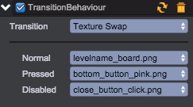
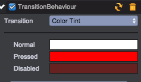

# TransitionBehaviour
行为组件qc.TransitionBehaviour，用于表现交互元素的状态：普通、按下、不可用。表现方式目前分为两类：图片帧变化、图片混合色变化。[Button](../Sample/Button.html)和[InputField](../Sample/InputField.html)默认内置了该脚本。

具有TransitionBehaviour脚本的游戏对象需要具有state属性，该属性为如下值：
* qc.UIState.NORMAL - 正常状态
* qc.UIState.PRESSED - 按下状态
* qc.UIState.DISABLED - 无效状态

## 图片帧变化
设置模式为 Texture Swap 后，根据本 gameObject 的状态切换为对应的贴图，例如设置如下  
  
对应的显示如下（分别是正常、按下、不可用）  
  
````javascript
var tb = button.getScript('qc.TransitionBehaviour');
// 设置为图片帧变化
tb.transition = qc.Transition.TEXTURE_SWAP;
// 正常状态图片帧
tb.normalTexture = 'button1';
// 按下状态图片帧
tb.pressedTexture = 'button2';
// 无效状态图片帧
tb.disabledTexture = 'button2';
````

## 图片混合色变化
设置模式为 Color Tint 后，根据本 gameObject 的状态切换为对应的混合色，例如设置如下  	
  
对应的显示如下（分别是正常、按下、不可用）  
  
````javascript
var tb = button.getScript('qc.TransitionBehaviour');
// 图片着色变化
tb.transition = qc.Transition.COLOR_TINT;
// 正常状态颜色
tb.normalColor = new qc.Color(0xffffffff);
// 按下状态颜色
tb.pressedColor = new qc.Color(0xffcccccc);
// 无效状态颜色
tb.disabledColor = new qc.Color(0xffcccccc);
````

## API
* [TransitionBehaviour API](http://docs.zuoyouxi.com/api/components/TransitionBehaviour.html)

## Demo
* [change-texture Demo](http://engine.zuoyouxi.com/demo/Button/disable-change-texture/index.html)
* [change-color Demo](http://engine.zuoyouxi.com/demo/Button/disable-change-color/index.html)
