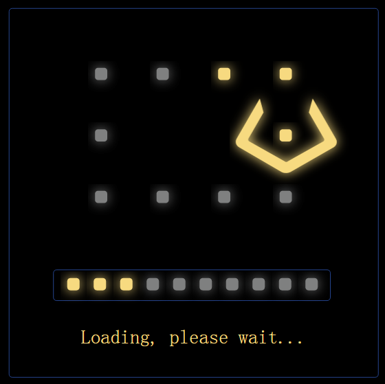

# 启动加载界面  
若工程设置中没有设置 [loadingPrefab 预制](loadingPrefab.md)，则启动加载界面会等待所有 js 文件和第一个场景的资源加载完毕；若有设置 [loadingPrefab 预制](loadingPrefab.md)，则启动加载界面只等待所有 js 文件加载完毕，第一个场景的资源加载由 [loadingPrefab 预制](loadingPrefab.md)负责显示加载界面。  

## 内置启动加载界面  
引擎提供了三种内置的启动加载界面：  
1. 吃豆子界面，见下图：  
	   
	该界面是引擎默认的启动加载界面，使用 svg 进行界面表现。在启动的 html 文件中，将 qici.config.loadingHandler 设置成 'svgHandler'，则使用该加载界面，默认已配置。  
	
2. 进度条界面，见下图：  
	   
	在启动的 html 文件中，将 qici.config.loadingHandler 设置成 'progressHandler'，则使用该加载界面。   
	
3. 静态背景图界面，见下图：  
	   
	将 qici.config.loadingHandler 设置成 'backgroundHandler'，则使用该加载界面。背景图或背景色可通过在 qici.config.loading 中设置 backgroundStyle 字段，值为 css 类型字符串，比如：  
		loadingHandler: 'backgroundHandler',
        loading: {
			backgroundStyle: "background-image:url(../../build/imgs/qici.png);background-size:100% 100%",
		}
	
## 定制启动加载界面  
1. 创建一个 js 文件，比如 testLoading.js，在文件中实现一个类，以 testHandler 为例，这个类必须实现以下三个方法：  
     a. void start(totalAssetCount) : 开始加载时，该方法会被调用，参数为资源总个数。  
     b. void progress(curCount) : 资源加载进度通知，参数为已加载的资源数。  
     c. void finish() : 所有资源加载完毕，该方法会被调用。  
	 
2. 实例化 testHandler 类，将其赋值给 qici.loadingHandler 变量，如：qici.loadingHandler = new testHandler();  

3. 在启动的 html 文件中，将 qici.config.loadingHandler 变量修改成自定义的 loadingHandler，如：  
		qici.config.loadingHandler = 'testHandler'  
	  
4. 在启动的 html 文件中，在加载 qc-loading.js 之后，配置上该 js 文件，如：
		<body onload="qici.init();">
			

				

				

			

			
			
		</body>  
		
## Demo
请参考 qc-loading-debug.js 中 backgroundHandler、progressHandler、svgHandler 三个类的实现。 

      
