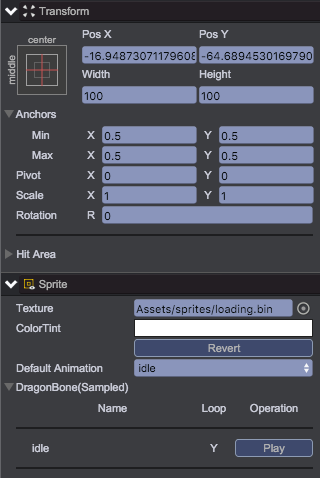
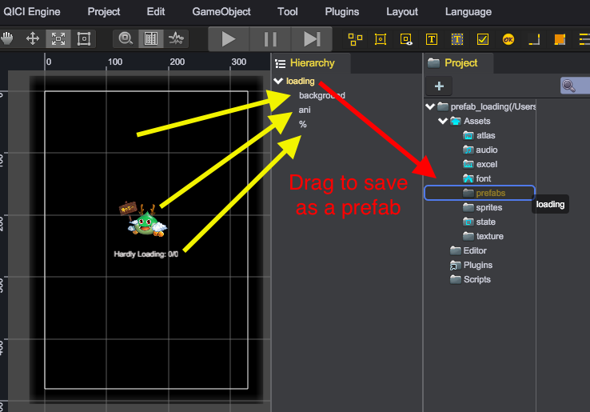
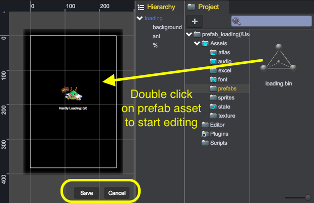

# 预制

## 预制的作用
在场景中可以很容易创建游戏对象并设置属性，但当有大量相同的游戏对象需要在场景中复用就成了问题，幸运的是青瓷引擎提供了预制类型资源，可以完整保存游戏对象属性、组件及其子孙对象。预制相当于模板，可用于在场景中创建新出的游戏对象实例，达到复用的效果。

## 预制的创建
游戏加载进度界面常用于不同游戏场景切换，为此我们构建一个prefab_loading的工程例子，来演示预制资源的创建：

1. 创建UIRoot类型对象loading，UIRoot会自动填充满屏幕界面，无需进行设置
2. 创建UIImage类型对象background，设置为黑色背景填充满UIRoot	
	
通过Transform面板的左上角按钮，按下Alt键，可快速设置填充满父节点效果	
	
3. 创建Sprite类型对象ani，该对象设置了骨骼动画，anchor设置在父亲节点的中间，将位置调节到偏上方显示	
	
4. 创建UIText类型对象%，该对象用于文字显示资源加载进度，anchor设置在父亲节点的中间，Pivot设置到顶部居中位置	
	
5. 将loading节点拖拽到Assets/Prefabs目录进行保存成loading.bin预制资源	
    

视频演示：  
<video controls="controls" src="../video/create_prefab.mp4"></video>

## 预制的使用
使用预制最简单的方式就是将资源直接拖拽到Hierarchy层次树的需要挂载的节点下，另外就是通过编码的方式创建实例对象：

````javascript
G.game.assets.load('loadingPrefab', 'Assets/prefabs/loading.bin', function(asset) {
    var node = G.game.add.clone(asset);
});
````
也可以通过G.game.assets.find('loadingPrefab');的方式查找出已加载的预制资源：

````javascript
G.game.assets.load('loadingPrefab', 'Assets/prefabs/loading.bin', function(asset) {
    var prefabAsset = G.game.assets.find('loadingPrefab');
    var node = G.game.add.clone(prefabAsset);
});
````
以上代码可在编辑器所在浏览器控制台中输入运行，其中G为编辑器的全局变量，方便用户调试测试。

## 预制的编辑

通过预制创建的游戏对象在Hierarchy层次树上会显示蓝色的文字效果，在场景中可对预制创建的游戏对象再次进行修改，然后点击Inspector上的Apply Prefab按钮，可将编辑后的游戏对象信息保存到对应的预制文件。	


另一种预制编辑方案，直接双击预制资源文件，当前游戏场景的游戏对象将全部自动隐藏，并根据预制构件出新的游戏对象实例，编辑完后只需点击Scene场景右下角的保存即可完成预制的编辑，也可点击取消按钮取消编辑，操作后当前场景的原先游戏对象会自动复原。	


## Demo
[Prefab Demo](http://engine.zuoyouxi.com/demo/index.html#anchor_Prefab)
