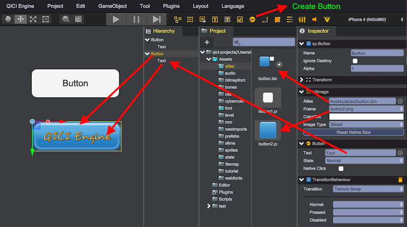
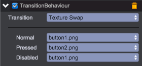

# 按钮
按钮组件qc.Button用于响应用户点击 	 
  

## 创建按钮
通过主菜单（游戏对象/按钮）或工具条创建，也可以通过如下代码动态创建按钮：
````javascript
node = game.add.button(parent);
````

## 按钮构成

* __按钮背景__  
按钮组件qc.Button继承于[qc.UIImage](UIImage.html)类型，因此其具有所有UIImage的功能特性，并默认启用了交互属性interactive为true。

* __文本__  
按钮组件下面默认挂载了一个UIText的孩子对象，用于显示按钮文字，如果无需显示文字可将其删除或隐藏。可通过node.text得到文本对象引用。
````javascript
    // 设置文本内容
    node.text.text = 'Start';
    
    // 设置字体大小
    node.text.fontSize = 16;
````

## 状态
按钮具有state状态属性，具有以下几种状态：
* __qc.UIState.NORMAL__ - 正常状态
* __qc.UIState.PRESSED__ - 按下状态
* __qc.UIState.DISABLED__ - 不可用状态
````javascript
// 设置按钮为不可用状态
node.state = qc.UIState.DISABLED;
````

## TransitionBehaviour
按钮默认挂载了qc.TransitionBehaviour脚本，可根据state状态实现不同呈现效果
````javascript
// 获取TransitionBehaviour脚本
tb = button.getScript('qc.TransitionBehaviour');
````

* NONE
不做任何处理，相当于无效该脚本功能
````javascript
tb.transition = qc.Transition.NONE;
````

* COLOR_TINT
根据不同的state状态，自动切换colorTint属性    

````javascript
tb.transition = qc.Transition.COLOR_TINT;
// 设置正常状态下colorTint值
tb.normalColor = new qc.Color(0xffffffff);
// 设置按下状态下colorTint值
tb.pressedColor = new qc.Color(0xffcccccc);
// 设置不可用状态下colorTint值
tb.disabledColor = new qc.Color(0xffcccccc);
````

* TEXTURE_SWAP
根据不同的state状态，自动切换frame图片帧属性  

````javascript
tb.transition = qc.Transition.TEXTURE_SWAP;
// 设置正常状态下frame值
tb.normalTexture = 'button1';
// 设置按下状态下frame值
tb.pressedTexture = 'button2';
// 设置不可用状态下frame值
tb.disabledTexture = 'button2';
````

## 监听点击事件

* 方案1：在按钮上挂载逻辑组件脚本，实现onClick点击处理函数：
````javascript
    var ButtonHandler = qc.defineBehaviour('qc.demo.ButtonHandler', qc.Behaviour, function() {
    
    }, {
        // 需要序列化的字段
    });
    
    // 按钮被点击的处理
    ButtonHandler.prototype.onClick = function() {
        // 处理逻辑
    };
````

* 方案2：在其他脚本中定义一类型为qc.Serializer.NODE的属性，将按钮与其建立关联：
````javascript
    var OtherHandler = qc.defineBehaviour('qc.demo.OtherHandler', qc.Behaviour, function() {
        this.btn = null;
    },
    {
        // 需要序列化的字段
        btn: qc.Serializer.NODE
    });
    OtherHandler.prototype.awake = function() {
        // 关注按钮被点击的事件
        this.addListener(this.btn.onClick, this.onBtnClick, this);
    };
    
    OtherHandler.prototype.onBtnClick = function() {
        // 按钮被点击的处理
    };
````

视频演示：  
<video controls="controls" src="../video/oper_button.mp4"></video>  


## Button 常用的API列表
[Button API](http://docs.zuoyouxi.com/api/gameobject/CButton.html)

## Button 相关 Demo
[Button Demo](http://engine.zuoyouxi.com/demo/index.html#anchor_Button)
